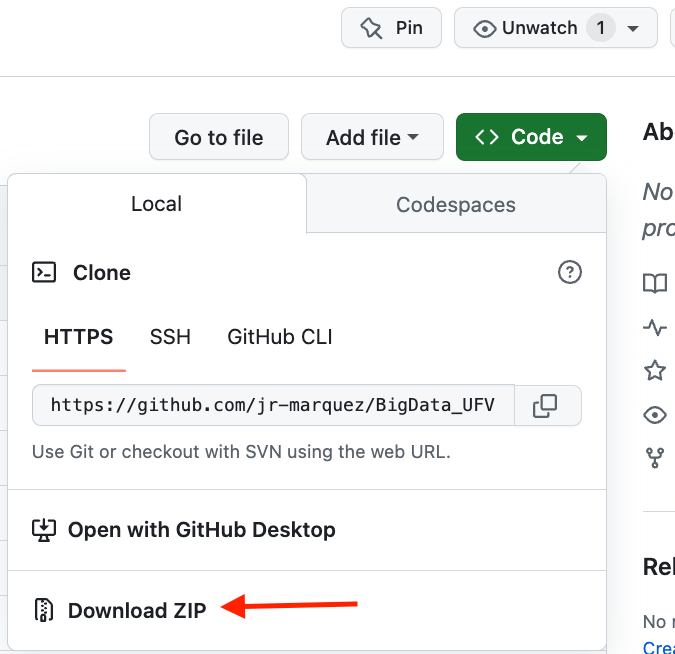

# BigData_UFV

## Instalación Docker Desktop

Dependiendo del sistema operativo:
* Windows: https://docs.docker.com/desktop/install/windows-install/
    * **Importante**:
        * Leer prerequisitos
        * Turn on the WSL 2 feature on Windows
        * BIOS-level hardware virtualization support must be turned on in the BIOS settings
* Mac:  https://docs.docker.com/desktop/install/mac-install/
    * **Importante**:
        * Leer prerequisitos

## Instalación Git

Recomendamos el uso de git para descargar versiones actualizadas de los reposittorios, sin embargo se puede descargar la carpeta como git en :

Tenemos dos opciones para instalar git en nuestros ordenadores:
* Instalación del client : https://github.com/cli/cli#installation
* Instalación de Git Desktop: https://docs.github.com/en/desktop/installing-and-configuring-github-desktop/installing-and-authenticating-to-github-desktop/installing-github-desktop

